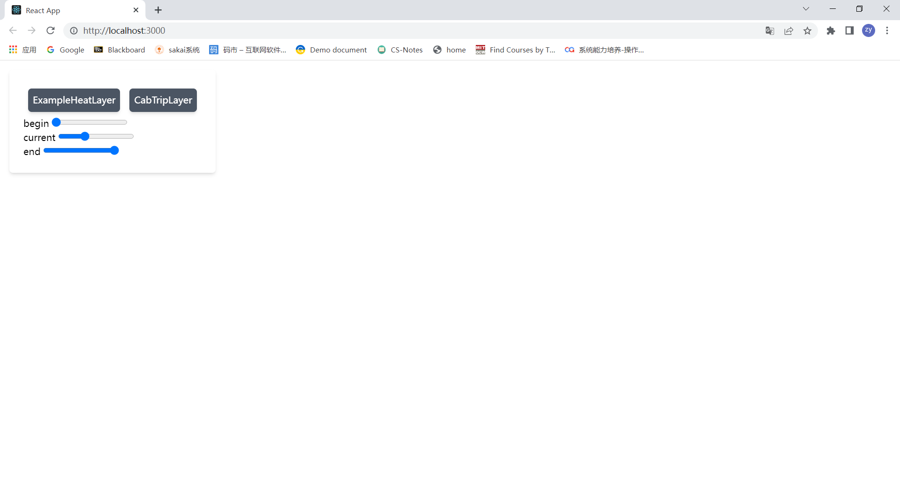
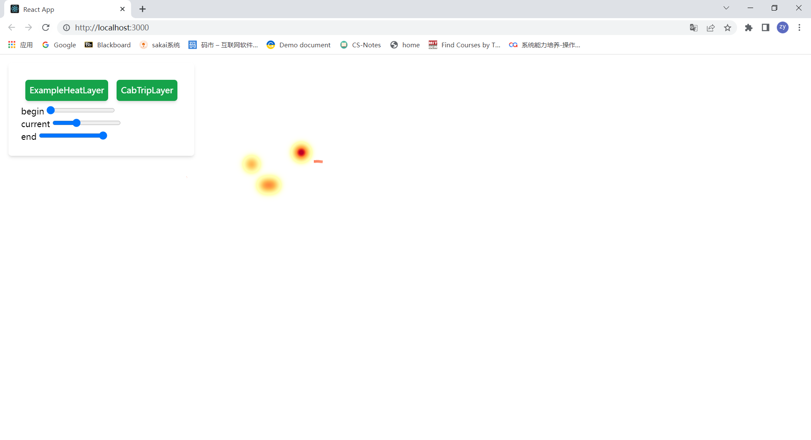
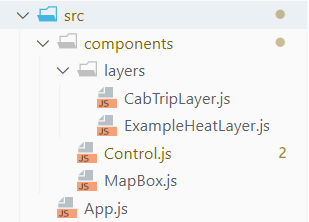

# 框架简要使用指南

本框架已解决绝大多数技术问题。剩下主要往里面补充内容即可。


## 运行

运行前，确保安装有最新版node.js和npm。一定要确保是最新版本！！本人本机用的是node.js v16.15.0，npm 8.10.0。

确定是最新版后，在工作目录运行npm install安装依赖，完成后运行npm start启动项目。如果运行正常，浏览器会打开并有以下界面：



点击两个按钮，页面会变成这样：



这样就算加载成功了。

如果需要显示地图，那就打开/src/components/MapBox.js，把这里的注释取消掉：

```react
function MapBox(props) {
    const layers = props.layers;
        return (
            <DeckGL
                initialViewState={INITIAL_VIEW_STATE}
                controller={true}
                layers={layers}
            >
                {/* <Map
                mapStyle="mapbox://styles/mapbox/dark-v9"
                attributionControl={false}
                mapboxAccessToken={MAPBOX_ACCESS_TOKEN}/> */}
            </DeckGL>
        );
}

```

但是平时写代码的时候还是把这里注释掉！！！API调用太多次<span style="font-size: 30px">会花钱的</span>！！！


## 结构



这时目前用到的所有有用的文件。

- layers文件夹下是所有用到的地图图层。

- Control.js是用户的控制台，就是地图左上角那个框。

- MapBox.js是整个地图。

- App.js是程序入口。

简要讲一下运行过程：

运行时，App.js会渲染Control和MapBox：

```react
    render() {
        return (
            <div>
                <MapBox layers={this.state.layers}></MapBox>
                <Control onChange={(vals) => {this.controlChange(vals)}}></Control>
            </div>
        )
    }
```

用户会在Control里操作。任何操作都会使onChange被调用，使其向App通知最新状态：

```react
    onChange = () => {
        this.props.onChange(this.state);
    }
```

App.js在controlChange()方法接受此回调。此时会更新App state里的layers：

```react
    generateLayer = (vals) => {
        return [
            ExampleHeatLayer({'visible': vals.enableExampleHeatLayer}),
            CabTripLayer({'visible': vals.enableCabTripLayer, 'current': vals.current})
        ];
    }

    controlChange = (vals) => {
        this.setState({'layers': this.generateLayer(vals)});
    }
```

state更新后，MapBox就会被重新渲染了：

```react
<MapBox layers={this.state.layers}></MapBox>
```


## 目标功能


我们会希望实现和kepler.gl控制台里类似的拖动时间段的设定（不过没必要做出他那个柱状图），以及可以选择需要显示的图层。控制台也要实现暂停、播放功能，用于自增current来实现动画效果。

具体功能来看，我们有两类功能，一种是基于时间段的统计（参考Control.js里begin和end这两个参数），例如统计本时间段里上车地点的可视化；另一种是基于时间点的动态变化（参考current参数），例如不同出租车随时间变化的行程图。这些功能具体有：

**基于时间段的统计：** 上车地点、上车地点聚类、下车地点、下车地点聚类。

**基于时间点的动态变化**：车辆行程、高峰路段。

以上每个功能都至少对应一个Layer。例如上车地点图可以用热力图（HeatmapLayer），上车地点聚类可以用标签（IconLayer），高峰路段则可以用路径（PathLayer）。


## TODOs

目前此框架配置了两个Layer，ExampleHeatLayer仅凑数用，供大家写作参考；CabTripLayer则是几乎已经完成的轨迹显示，只需后端接入数据微调参数即可。所以剩下的任务主要如下：

#### 实现控制台

控制台目前外观非常简陋，并且还不能实现自动播放。这一部分需要优化外观，实现暂停、播放功能，以及隐藏、展开功能。

#### Layer

按照上一节的功能，实现所有对应的Layer（大约6个）。

#### 数据对接

每个Layer最后都要与后端进行数据对接。这需要每个Layer的编写者了解不同Layer所需要的数据格式，自行与后端对接。

#### 报告页

我们会有一个专门的报告页，额外用于展示后端的一些分析数据。可以考虑让用户点击控制台内的某个按钮后，打开此页。


## 在写代码之前...

- 本次我们的代码主要使用react和deck.gl编写。因此在阅读代码之前，建议先简单掌握react的使用（否则应该...看不懂）。并不需要精通！能把入门教程完整看懂并能差不多能跟着实现就可以了：https://react.docschina.org/tutorial/tutorial.html
- deck.gl需要了解如何使用。推荐至少读懂 [Using Layers ](https://deck.gl/docs/developer-guide/using-layers)这一章以及它的前置内容。

- 本框架同时安装了tailwind作为样式库。作为css的简易平替，可以去简单看看如何使用。（单纯写layer的就没必要看了）https://www.tailwindcss.cn/ 不太建议再去单独下载组件库！主要是环境太难配了，而且就为了写一个控制台也没必要...建议原生css或tailwind。（而且tailwind是框架无关的，也就是说原生和绝大多数框架都可以使用。个人感觉非常方便！）

- 我们本次的代码风格参考java。即：文件命名双驼峰，类双驼峰，常量全大写加下划线，其余均为单驼峰。

- 我们代码使用git管理。无论是实现功能，想要测试新写法，都记得新开一个分支，不要污染代码库
